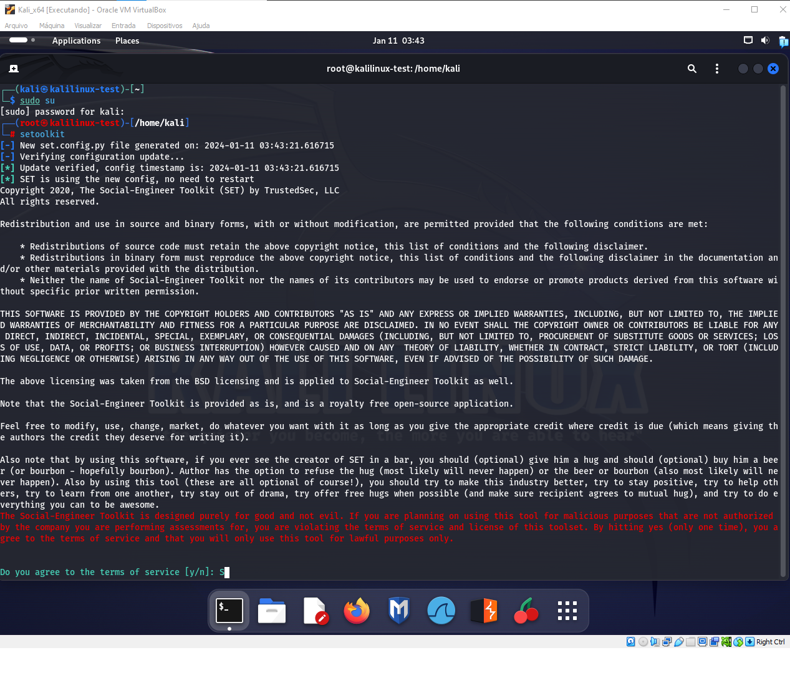
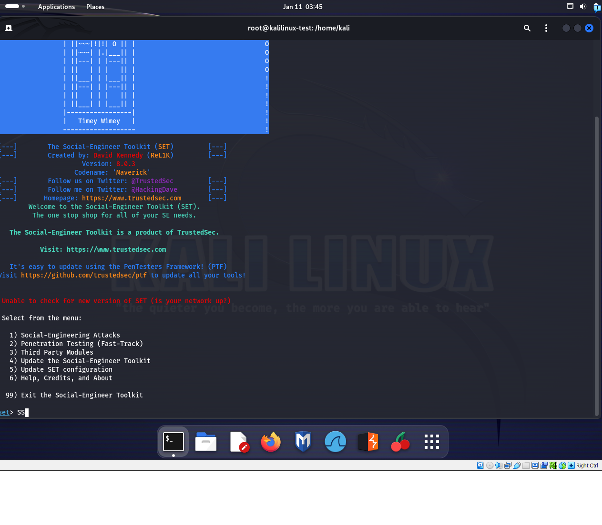
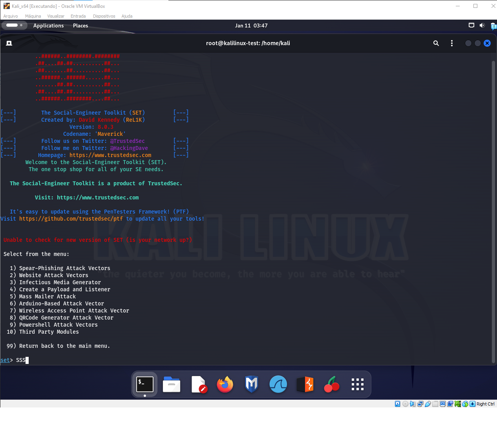
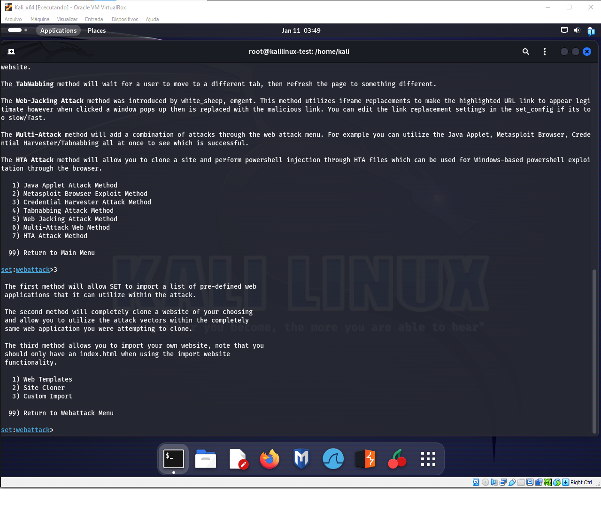
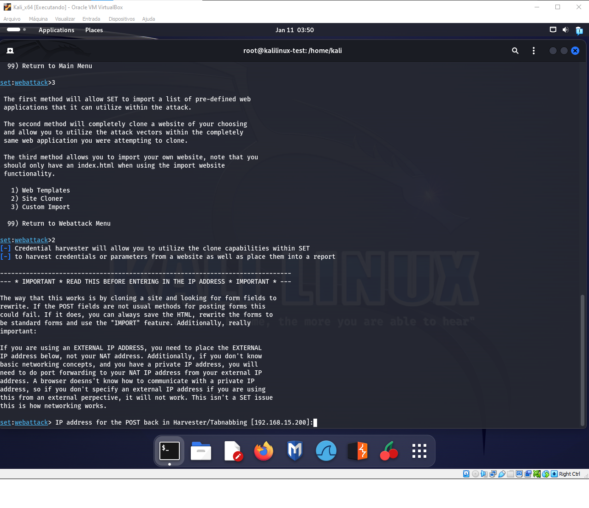
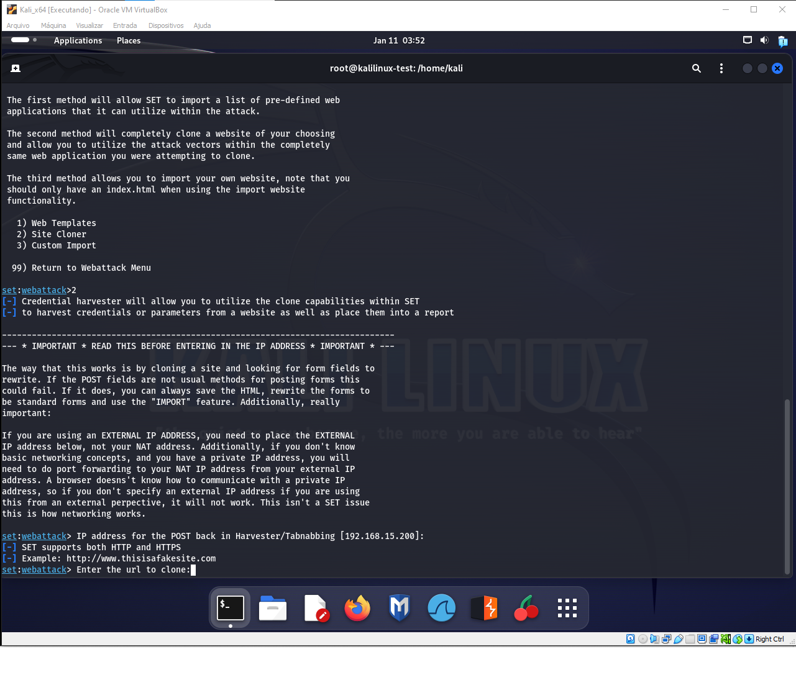
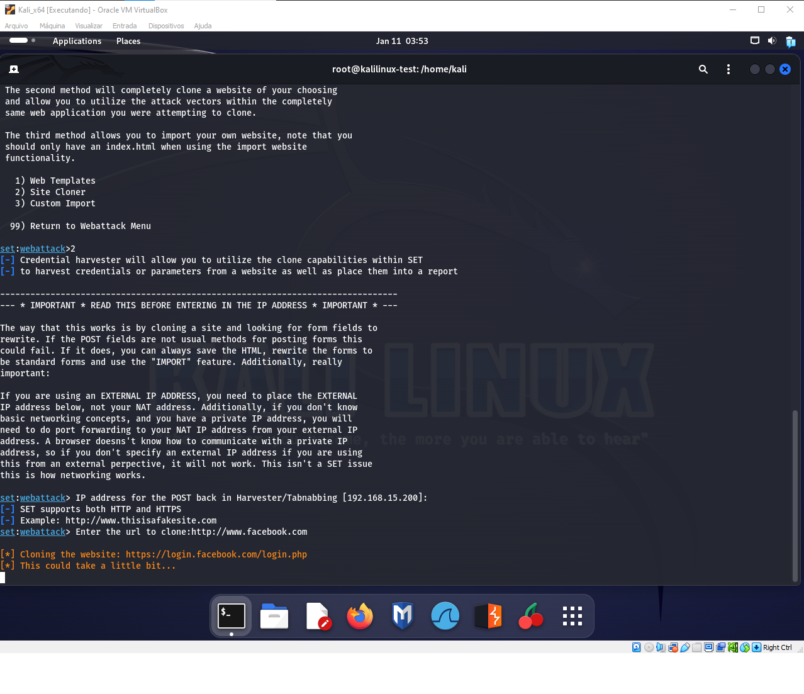
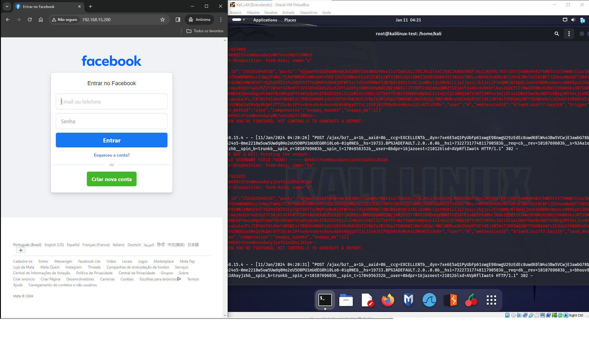
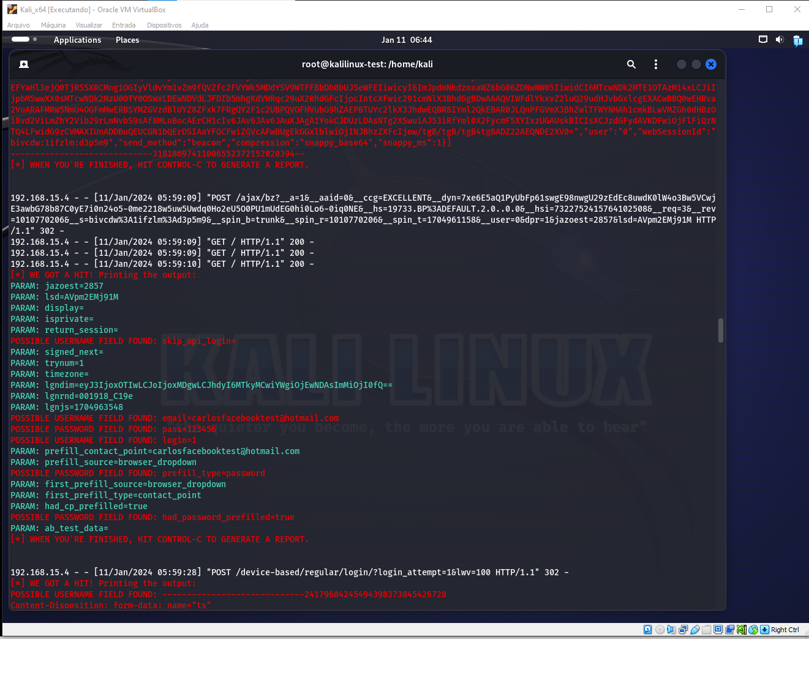

Social-Engineer Toolkit (SET) - Ataque de Engenharia Social

Este repositório contém uma descrição detalhada do uso do Social-Engineer Toolkit (SET) para realizar um ataque de engenharia social usando a técnica de coleta de credenciais por meio de um site clonado do Facebook.

Instruções Passo a Passo:
Iniciar o SET:

1º passo é executar o sudo su no Linux para entrar como usuárioo raiz e depois executar o comando setoolkit no terminal e digitar 'Y' para confirmar o início do SET.

Selecionar o Tipo de Ataque:

Escolher a opção '1' para ataques de engenharia social e pressionar 'Enter'.
Selecionar Vetores de Ataque para Sites:

Escolher a opção '2' para vetores de ataque a sites.
Escolher Método de Ataque de Coleta de Credenciais:

Selecionar '3' para o método de ataque de Coletor de Credenciais.
Selecionar a Ferramenta de Clonagem de Site:

Optar pela opção '2' para utilizar a ferramenta de clonagem de sites.
Configurar o Endereço IP:

Inserir o endereço IP local, que neste caso é '192.168.15.200', e pressionar 'Enter'.
Inserir o URL do Alvo:

Digitar o URL do site alvo, neste caso, http://www.facebook.com, e pressionar 'Enter'.
Acessar uma Aba Anônima no Windows:

Abrir uma nova aba anônima no navegador do Windows e digitar o IP '192.168.15.200' para verificar se o Facebook foi clonado pelo SET.
Acesso à Tela Clonada do Facebook:

Ao acessar o link, uma tela clonada do Facebook será exibida, simulando a página de login real.

No último passo, a tela exibida mostra as informações que foram coletadas no site clonado. As credenciais fornecidas são: carlosfacebooktest@hotmail.com como email e 123456 como senha no SEToolkit. É importante ressaltar que consegui realizar o processo apenas uma vez, apesar de várias tentativas, devido a um problema não solucionado no botão de envio (submit) no momento.

Obs: 
Este conjunto de comandos no SET visa realizar um ataque de engenharia social usando a técnica de coleta de credenciais por meio de um site clonado do Facebook. O objetivo é obter credenciais de login falsas de um usuário ao induzi-lo a inserir informações na página clonada.